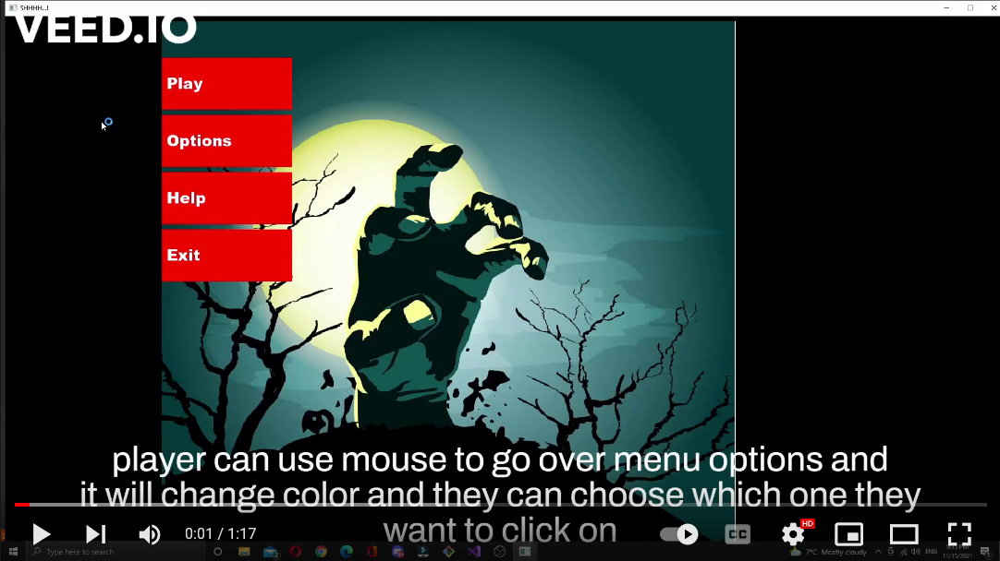

# SHHHHHH...!

SHHHHHH...!! is a two-dimensional top-down view game where the player has to escape cursed islands infested with zombies. If a zombie catches you, you die. To escape the island, there is no other choice for the player to not make any noise. The zombies are blind and will reach the position of the last heard noises, but watch out where you walk, some surfaces make more noises and the farthest zombies could hear you!

## The First Minute of Gameplay

The Player opens up the game and sees the menu. It has 3 options: Play, Help and Exit.  
The player clicks **play** and is presented with the first level, this level is mostly empty, and is here to show the mechanisms of the game to the player. On the left, there are 4 tiles of terrain, upon stepping on them the player sees sound waves of varying size appearing. If the player changes its speed (Run instead of Walk), the player will make more noise.   

The player can then reach down to a bottle, and upon colliding with it, its moves to its bag. The player can hold the CTRL button and upon release, the bottle gets thrown against the nearby wall, which creates noises.   

Finally, to the right, it notices that a zombie is facing away, it walks behind it. The zombie doesn’t see the player but it reacts to the noise and starts to chase the player. When it catches the player the game transitions to a game over screen.

## Technologies

* SFML 2.5.1
* C++
* Visual Studio compiler

## Authors

* Masih Sh (https://github.com/Masih-Sh)
* Eoin Galavan (https://github.com/EoinGalavan)
* Adrien Dudon (https://github.com/Deewens)

## Demo Videos

These videos will show you the progress of the game over three sprints.

### Sprint 1
Click on the thumbnail or follow this link to see the video: https://youtu.be/xSUOnF6W-xM

### Sprint 2
Click on the thumbnail or follow this link to see the video: https://youtu.be/ttwk3m449Fk

### Sprint 3
Click on the thumbnail or follow this link to see the video: https://youtu.be/2pdfMR2FLxk

## Interesting Technical Features

Although the game may not seems amazing or grahically beautiful, it features some interesting system that we had to develop from scratch.

### Pathfinding (UCS and A*)

TODO

### Level Builder

TODO

### Resources Manager

TODO